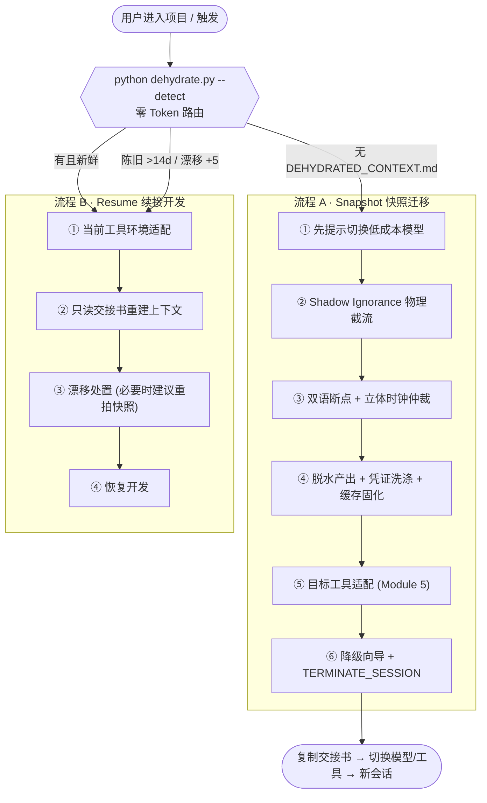

<div align="center">

# 🪄 神灯AI·项目迁移穿梭机
### MagicLamp AI · Project Migration Shuttle

**跨工具 / 跨模型迁移"开发中"项目的零 Token 冷启动燃料与行为约束器**
*Zero-token cold-start fuel for handing off half-finished projects across AI tools & models.*

<p>
  
  
  
  
  
  
</p>

</div>

---

## 🎯 它解决什么问题

当你把一个**开发到一半**的项目从 Cursor 换到 Antigravity、从一个模型换到另一个模型、或仅仅是重置了会话——新环境会**盲目全量读盘**,把旧工具的缓存、编译产物、超长日志、向量库一并吞进上下文,瞬间烧光 Token,还可能覆盖你未提交的代码。

**穿梭机**在交接发生前,用**纯确定性脚本(零大模型 Token)**完成:物理隔离污染、双语断点检索、冲突真理源仲裁、凭证脱敏,最终产出一份**缓存友好**的交接书 `DEHYDRATED_CONTEXT.md`,让新环境"读一页纸即可满血续接"。

---

## ✨ 核心特性

| 能力 | 说明 |
|------|------|
| 🛡️ **Shadow Ignorance** | 零 Token 嗅探技术栈,把隔离补丁**强制置顶**写入 `.gitignore` / `.cursorignore` / `.aiderignore` / `.claudeignore`;可选硬链接影子工程做物理隔离 |
| 🌐 **中英双语断点检索** | 双轨模糊匹配 PRD/需求、README/CHANGELOG、TASK/任务;状态归一为 `[DONE]` / `[ACTIVE_BREAKPOINT]` / `[IRON_LAW]` |
| ⏱️ **立体时钟仲裁** | Git 逻辑时钟(A)/ 暂存区脏代码捕获(C)/ 虚拟物理时钟+语义熵(B)三级级联,定位"最高真理源",死锁时非阻塞标记 `[CRITICAL_CONFUSED_ZONE]` |
| 🔐 **凭证洗涤** | 正则 + Shannon 高熵双重扫描,任何密钥/Token/密码 → `[REDACTED_SECRET_HASH_SHA256:…]`,键值对仅抹值保留字段名 |
| 💾 **缓存强固化** | 静态头部 + 1–6 节字节级稳定,易变元数据置尾,最大化命中云端提示词缓存折扣 |
| 🔀 **双流程路由** | `--detect` 零 Token 判定 Snapshot(快照迁移)/ Resume(续接开发),并感知陈旧与 git 漂移 |
| 💰 **成本向导** | 快照前置提示切换低成本模型,结尾输出降级向导与 `[TERMINATE_SESSION]` |

---

## 🧭 两条工作流



---

## 🚀 快速开始

> 依赖:**Python 3.8+** 与 **git**(均为系统自带级常见工具),无任何第三方包。

### 安装为 Skill

将本目录复制到你的 Skill 目录即可被自动发现:

```bash
# 项目级
cp -r MagicLamp_AI_projec_migration  <your-project>/.claude/skills/
# 或全局
cp -r MagicLamp_AI_projec_migration  ~/.claude/skills/
```

### 触发词

| 流程 | 触发 |
|------|------|
| **Snapshot** | `/migrate`、"迁移项目"、"生成快照"、"换工具/换模型继续"、"脱水上下文" |
| **Resume** | "继续开发"、"理解项目"、"了解项目状态"、"恢复进度"、"阅读交接书" |

### 直接命令行使用(可独立于模型运行)

```bash
# 0) 零 Token 路由探测:决定走 Snapshot 还是 Resume
python scripts/dehydrate.py --root <PROJECT_ROOT> --detect

# 1) 注入多生态忽略文件(隔离补丁置顶,幂等)
python scripts/dehydrate.py --root <PROJECT_ROOT> --apply-ignores

# 2) 生成交接书 DEHYDRATED_CONTEXT.md
python scripts/dehydrate.py --root <PROJECT_ROOT> --out DEHYDRATED_CONTEXT.md

# 仅输出 JSON 信号,不落盘
python scripts/dehydrate.py --root <PROJECT_ROOT> --signals-only

# 物理隔离兜底:在系统临时目录建立硬链接影子工程(保留 .git 与锁文件)
python scripts/shadow_project.py --root <PROJECT_ROOT>
```

---

## 📂 目录结构

```
MagicLamp_AI_projec_migration/
├── SKILL.md                    # 技能主文件:双流程编排 + 五模块 SOP
├── scripts/
│   ├── dehydrate.py            # 零 Token 脱水引擎(检测/隔离/检索/仲裁/洗涤/产出)
│   └── shadow_project.py       # 硬链接影子工程构建器(物理隔离兜底)
├── references/
│   ├── adaptive_matrix.md      # 模块五:目标工具初始化自适应矩阵 + 降级向导
│   └── output_schema.md        # 交接书缓存稳定 Schema 规范
└── README.md
```

---

## 🧩 五大模块

1. **模块一 · Shadow Ignorance** — 物理截流与多生态屏蔽。
2. **模块二 · 立体时钟** — 双语断点检索 + A/B/C 冲突真理源仲裁(非阻塞)。
3. **模块三 · Dehydration** — 凭证洗涤、绝对锚定、视界截断、缓存强固化。
4. **模块四 · 成本控制** — 低成本模型向导 + `[TERMINATE_SESSION]` 会话闭环。
5. **模块五 · 自适应适配** — Antigravity / Hermes / 通用 IDE·MCP 初始化驱动。

> 详细规范见 [`SKILL.md`](./SKILL.md) 与 [`references/`](./references)。

---

## 📄 交接书 `DEHYDRATED_CONTEXT.md` 结构

```
# DEHYDRATED_CONTEXT        ← 静态头部(可缓存)
[CRITICAL_CONFUSED_ZONE]    ← 仅当仲裁死锁时出现
1. STACK
2. TRUTH_SOURCE_RANKING     ← 立体时钟排序
3. ATOMIC_BREAKPOINTS       ← [DONE]/[ACTIVE_BREAKPOINT]/[IRON_LAW]
4. GIT_HIGHLIGHT_ZONE       ← 防覆盖未提交代码
5. SHADOW_IGNORANCE
6. TARGET_TOOL_INIT
---                         ← 易变区分隔线
VOLATILE_METADATA           ← 时间戳/路径(置尾,不破坏缓存)
[TERMINATE_SESSION]
```

---

## 🔒 安全

- **凭证零外泄**:OpenAI/Anthropic/AWS/Google/GitHub/Slack/JWT 模式 + 高熵串全部 SHA256 占位化。
- **防覆盖**:`git status` 摘要进入"高亮观察区",提醒新模型勿覆盖未提交改动。
- **本地 BOM 兼容**:`utf-8-sig` 解码,兼容 Windows/中文文档常见 BOM。

---

## 🤝 关于

神灯AI(MagicLamp AI)出品 · 隶属 [MagicLamp-AI-Studio](https://github.com/ala2017/MagicLamp-AI-Studio)。

## 📜 License

MIT
